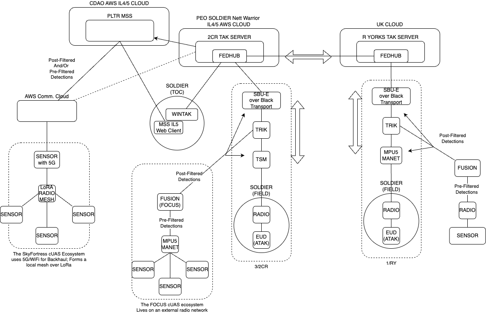
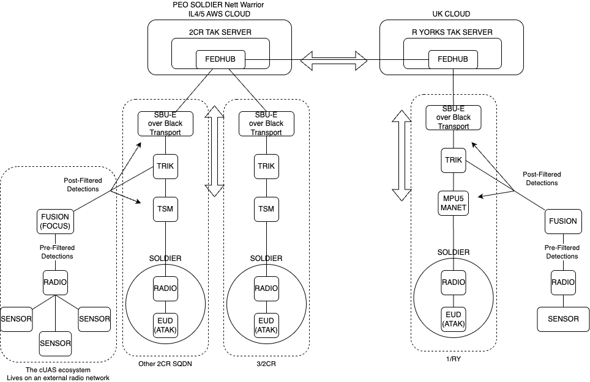
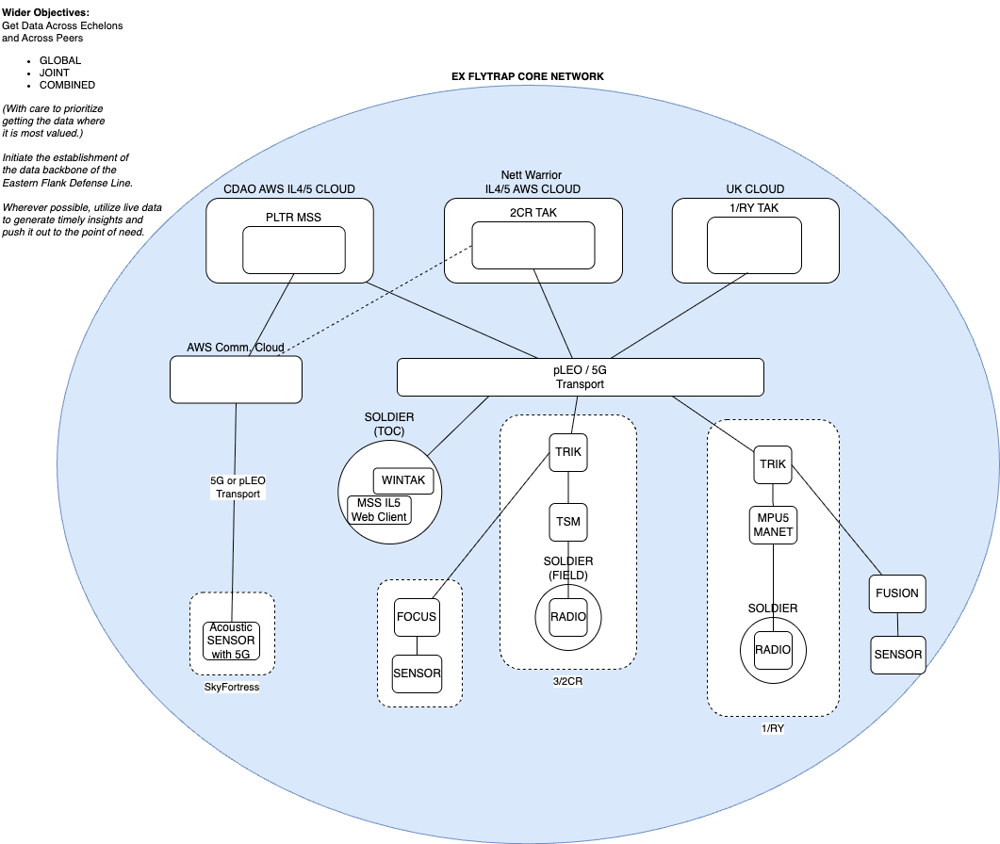
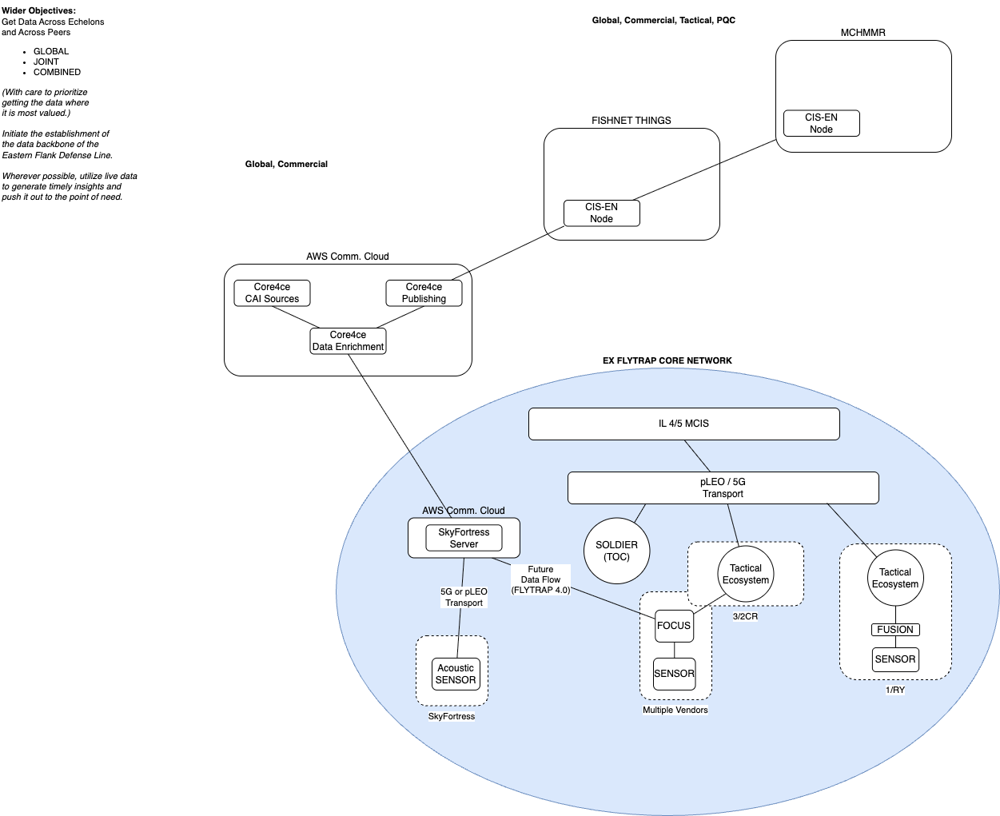

# FLYTRAP-ALL-ARCH
## Network Architecture Overview

At JOINT EX FLYTRAP / VANNEHEIM, the following diagrams illustrate how the network operates and how data flows both locally and globally. Refer to the `.drawio` files as authoritative sources; the `.png` images are generated from these files.

### Baseline

- **baseline**  
    Shows the core networking and architecture at EX FLYTRAP.

    
    
    [Download EXFLYTRAP-DATAPIPES-BASELINE.drawio](baseline/EXFLYTRAP-DATAPIPES-BASELINE.drawio)

- **baseline-realops**  
    Illustrates the architecture with more than one 2CR SQDN. Note: these cannot communicate directly with each other—they must route up and out into the Nett Warrior cloud and back.

    
    
    [Download EXFLYTRAP-DATAPIPES-BASELINE-REALOPS.drawio](baseline/EXFLYTRAP-DATAPIPES-BASELINE-REALOPS.drawio)

### Simplified

- **simplified-wideview-core**  
    Presents the core EX FLYTRAP architecture in a condensed form, preparing it for global data flow presentation.

    
    
    [Download EXFLYTRAP-BASELINE-SIMPLIFIED-WIDEVIEW-CORE.drawio](simplified/EXFLYTRAP-BASELINE-SIMPLIFIED-WIDEVIEW-CORE.drawio)

### Global

See GLobal Data Flow Diagrams in separate README files nearest to the diagram, for a broader view of how data is shared and utilized across different environments.

[Global Data Flow Diagrams](global/README.md)
As an example, here is one of the global data flow diagrams:

- **wideview-core4ce**  
    Demonstrates collaboration with core4ce to enrich data with operationally relevant information, expedite its return to the warfighter, and share it with other environments for broader learning and action.

    
    
    [Download EXFLYTRAP-BASELINE-SIMPLIFIED-WIDEVIEW-Core4ce.drawio](global/core4rce/EXFLYTRAP-BASELINE-SIMPLIFIED-WIDEVIEW-Core4ce.drawio)

---
**File Reference:**  
- `.drawio` files: Source diagrams  
- `.png` files: Rendered images for quick reference